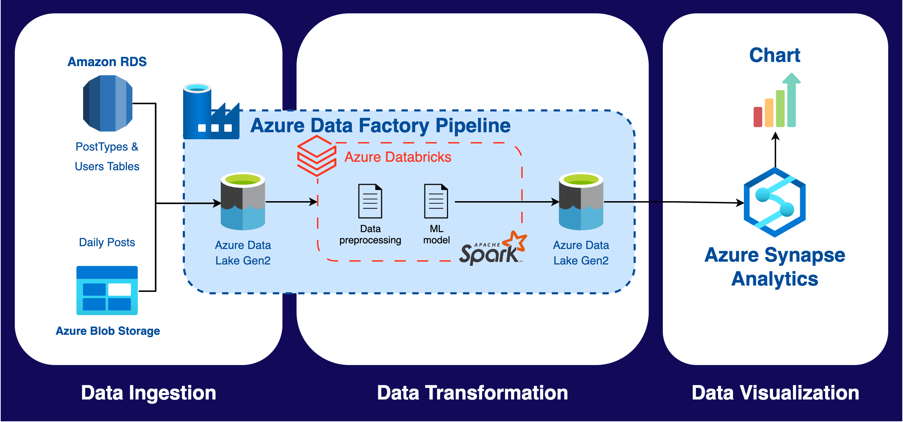

# Azure Big Data Analytics

## Project Overview
The objective of this project is to use big data analytics systems to process data and train a machine learning classifier. Daily posts are processed and passed through an ML classifier to predict their tags.

## Project Architecture

## The project utilizes the following Azure resources:

1. **Azure Data Factory**: Used to create and orchestrate an ETL pipeline, extracting data from the sources, transforming it, and loading it into a data lake.
2. **Azure Monitor**: Used to monitor any failures in the ADF pipelines and create email alerts.
3. **Azure Key Vault**: Used to store secrets (passwords & access tokens) safely and effectively.
4. **Azure Data Lake Gen2**: Used to store raw data initially (landing zone), then store the transformed data for analysis.
5. **Azure Databricks**: Used to process the data using Spark's distributed computing power. Spark ML was also used to train and deploy a classifier.
6. **Azure Synapse Analytics**: Used for data analysis, querying data from the data lake and creating simple charts.

## Data Sources
The data used in this project consists of Stack Overflow posts, post types, and users. The data is ingested from two external sources:

1. Amazon RDS PostgreSQL DB
2. Azure Blob Storage

## Getting Started

To set up the project, follow these steps:

1. Provision the required Azure resources.
2. Configure the data sources and connections in the Azure services.
3. Implement the ETL pipeline in Azure Data Factory.
4. Process the data and train the machine learning classifier in Azure Databricks.
5. Analyze the data and create visualizations in Azure Synapse Analytics.
